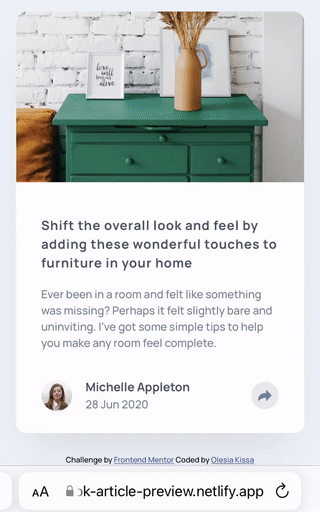
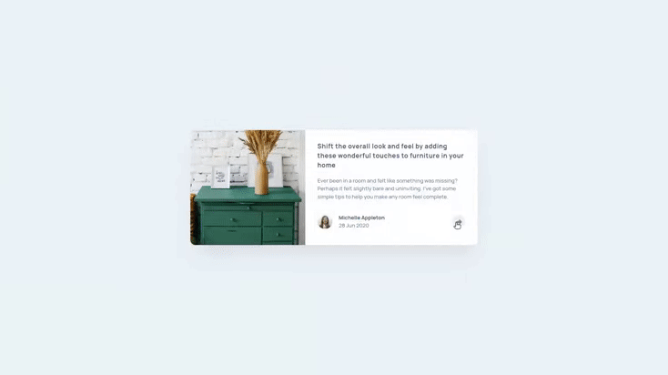

# Frontend Mentor - Article preview component solution

This is a solution to the [Article preview component challenge on Frontend Mentor](https://www.frontendmentor.io/challenges/article-preview-component-dYBN_pYFT)

## Table of contents

- [Overview](#overview)
  - [The challenge](#the-challenge)
  - [Screenshots](#screenshots)
  - [Links](#links)
- [My process](#my-process)
  - [Built with](#built-with)
  - [What I learned](#what-i-learned)
  - [Continued development](#continued-development)
  - [Useful resources](#useful-resources)
- [Author](#author)

## Overview

### The challenge

Users should be able to:

- View the optimal layout for the component depending on their device's screen size
- See the social media share links when they click the share icon

### Screenshots

##### MOBILE

##### DESKTOP

### Links

- Solution URL: [go to](https://git.io/JD5F1)
- Live Demo: [go to](https://fmok-article-preview.netlify.app/)

## My process
### Built with

- Mobile-first workflow
- CSS custom properties, Flexbox, Grid
- jQuery

### What I learned

:arrow_right: In this project I learned how to create and position popups.

:arrow_right: I also learned how to create sharing functionality.

:arrow_right: The main difficulties were:
  - <i>creating the logic of opening and closing the modal window based on screen size</i>
  - <i>creating the correct flow for the screen reader when it comes to buttons (I used ChromeVox Screen Reader for testing things out)</i>

### Continued development

:bulb: I think that this project can be improved by adding open graph meta tags which help to organize content during sharing process (e.g. this will help to add images to the article during sharing to Twitter or Pinterest).

:bulb: It would be nice to implement the centering of share dialog in desktop version.

### Useful resources

- [Window object (MDN)](https://developer.mozilla.org/en-US/docs/Web/API/Window/open)
- [Share Functionality (Medium article)](https://jagathishsaravanan.medium.com/adding-share-functionality-to-your-website-with-javascript-2b7d2b62f09e)
- [Sharing Links (CSS Tricks)](https://css-tricks.com/simple-social-sharing-links/)
- [Icon buttons a11y concerns (MDN))](https://developer.mozilla.org/en-US/docs/Web/HTML/Element/button#accessibility_concerns)
- [Button state and a11y (gomakethings article)](https://gomakethings.com/button-state-and-accessibility/)
- [ChromeVox (Screen Reader Chrome Extension)](https://chrome.google.com/webstore/detail/screen-reader/kgejglhpjiefppelpmljglcjbhoiplfn?hl=en)

## Author

Frontend Mentor Profile - [@olesiakissa](https://www.frontendmentor.io/profile/olesiakissa)