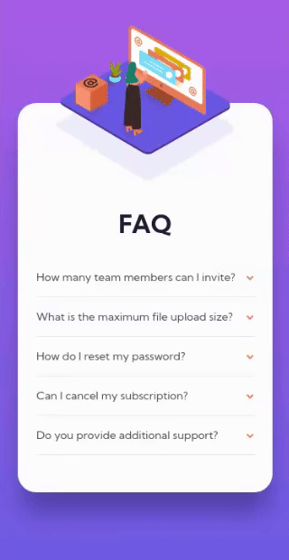
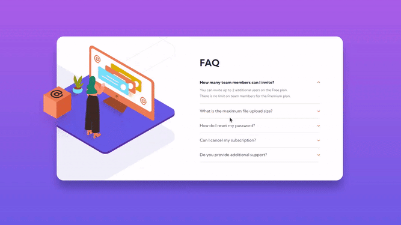

# Frontend Mentor - FAQ accordion card solution

This is a solution to the [FAQ accordion card challenge on Frontend Mentor](https://www.frontendmentor.io/challenges/faq-accordion-card-XlyjD0Oam)

## Table of contents

- [Overview](#overview)
  - [The challenge](#the-challenge)
  - [Gifs](#gifs)
  - [Links](#links)
- [My process](#my-process)
  - [Built with](#built-with)
  - [What I learned](#what-i-learned)
  - [Continued development](#continued-development)
- [Author](#author)

## Overview

### The challenge

Users should be able to:

- View the optimal layout for the component depending on their device's screen size
- See hover states for all interactive elements on the page
- Hide/Show the answer to a question when the question is clicked

### Gifs

##### MOBILE

##### DESKTOP

### Links

- Solution URL: [go to](https://git.io/JMghv)
- Live Demo: [go to](https://fmok-faq-accordion.netlify.app/)

## My process

### Built with

- Mobile-first workflow
- CSS custom properties
- CSS Grid
- VanillaJS

### What I learned

:arrow_right: In this project I learned how to create collapsibles that allow to open only one section at a time. 

:arrow_right: I also had a lot of fun with the positioning of elements and animations.

### Continued development

:fast_forward: I think that this component can be improved by
  - creating dark theme
  - making button & link elements more accessible by editing :focus attributes
  - changing the display logic of illustration to get rid of hardcoded positioning

## Author

Frontend Mentor Profile - [@olesiakissa](https://www.frontendmentor.io/profile/olesiakissa)
